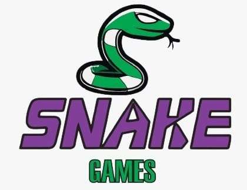

<!DOCTYPE html>
<html lang="es">
<head>
    <meta charset="UTF-8">
    <meta name="viewport" content="width=device-width, initial-scale=1.0">
    <title>Catálogo de Juegos</title>
    
</head>
<body>
    <header>
        <?php
            session_start(); // Inicia la sesión si no está iniciada
            if(isset($_SESSION['nombre'])) {
                $nombre = $_SESSION['nombre'];
                echo "<h1>Bienvenido: $nombre Catálogo de Juegos</h1>";
            } else {
                echo "<h1>Catálogo de Juegos</h1>";
            }
        ?>
    </header>
    

    

        

            
            <h3>Snake</h3>
            
 La mecánica del juego Snake consiste en guiar el a una serpiente en movimiento continuo que va creciendo de longitud a medida que va comiendo fruta de la pantalla, a través del joystick el usuario puede cambiar la dirección de la cabeza de la serpiente.

            <button onclick="window.location.href='juego1.html'">Click para jugar</button>
        

        

            
            <h3>Buscaminas</h3>
            
El juego debe su popularidad a las versiones que vienen con Microsoft Windows desde su versión 3.1.

                El juego posee un sistema de récords para cada uno de Los 4 niveles en el que se indica el menor tiempo en terminar el juego.

                <button>Próximamente</button>  
            

        

            
            <h3>Pac-man</h3>
            
Pac-Man fue creado por el diseñador Toru Iwatani, de la empresa japonesa Namco. El juego consiste en conducir a Pac-Man, una bola amarilla que abre y cierra la boca, por un laberinto. Suma puntos cuando come aquello que encuentra a su paso, bolitas y diferentes frutas, pero debe esquivar a cuatro fantasmas.

            

            

            <button>Próximamente</button> 
        

    

</body>
</html>

